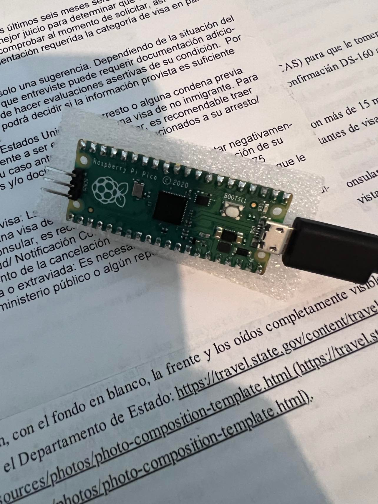
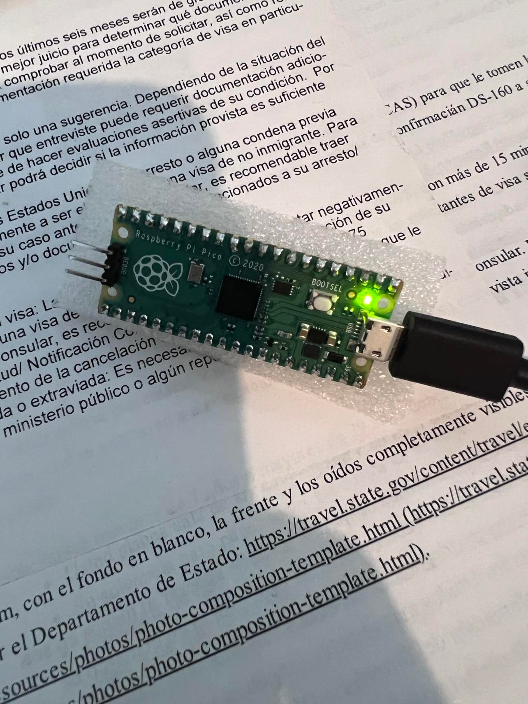
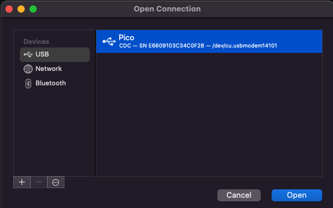

------

<pre>

	<p align=center>

Tecnológico Nacional de México
Instituto Tecnológico de Tijuana

Departamento de Sistemas y Computación
Ingeniería en Sistemas Computacionales

Semestre:
Febrero - Junio 2022

Materia:
Lenguajes de interfaz

Docente:
M.C. Rene Solis Reyes 

Unidad:
RP2040 PICO

Título del trabajo:
RaspberryPICO RP2040 C++ Básicos 

Estudiante:
Mejia Cruz Jose Eduardo - 18210500

	</p>

</pre>

---

# Pre steps -> Configuration on MacOS

### Ensure that all is congure propertly.
```
brew doctor
brew update
brew upgrade 
```
### Install the toolchain by using **Homebrew**
```
brew install cmake
brew tap ArmMbed/homebrew-formulae
brew install arm-none-eabi-gcc 
```
### Create working directory
```
cd
mkdir pico
cd pico
git clone -b master https://github.com/raspberrypi/pico-sdk.git
cd pico-sdk
git submodule update --init
```

### Get the example code
```
pwd
cd ..
git clone -b master https://github.com/raspberrypi/pico-examples.git
```
---

# Compiling and running Blink (need build directory important)
```
cd pico-examples
mkdir build
cd build
```
### Set the path to where the SDK can be found
```
export PICO_SDK_PATH=../../pico-sdk
```

### Get the build directory ready for cmake
```
cmake ..
cd blink
make -j4
ls

echo "Ready lets copy to RP2040 please conect your board press BOOTLOADER button, realease when conecting"
echo " you should view new volumen apear on Finder"
echo " Copy .UF2 to Pico"

diskutil list
cp blink.uf2 /Volumes/RPI-RP2
```
You should now have a blink.uf2 file inside the build/blink directory

- Connect a Raspberry Pi Pico via USB to the Mac. Hold down BOOTSEL to get access to the storage.
- Drag the file named ```blink.uf2``` over to the attached drive named RPI-RP2.
- The drive will be disconnected and the blink program should start running that constantly flashes the LED.





---

# Build "Hello World"

### As we did for the previous "Blink" example, change directory into the hello_world directory inside the pico-examples/build tree, and run make.
```
cd ../hello_world
make -j4
ls
echo "This will build two separate examples programs in the hello_world/serial/ and hello_world/usb/ directories, use 1st part"
cp usb/hello_usb.uf2 /Volumes/RPI-RP2

```

### How to view messages via USB stream

1. Run ```ls /dev/tty.* ``` to list each serial conection 
2. Unplug the Pi Pico and run the same command as above to locate the port missing
3. Plug in Pi Pico again
4. Run the command screen ```[serial port located above]``` e.g. ```screen /dev/tty._______```

A screen will promt up printing Hello, world! imediatitly. 

```
ls /dev/tty.*
screen /dev/tty.usbmodem14101   (to CHANGE it)

```
PRESS KEYS: Ctrl + A, Ctrl + D ... (to "minimize" or Dettach)

```
screen -r   (to RESTORE it)
```
PRESS KEYS: Ctrl + A, Ctrl + K ... (to KILL current process)

```
ps  (to VIEW procees, please note $screen running)
ps kill  _#__ (any problems you can kill the process number of $screen is the left PID)
```




