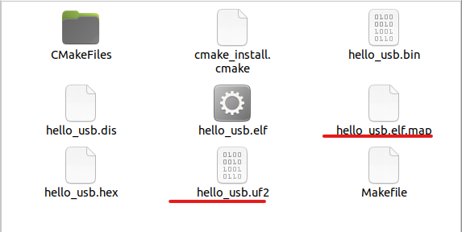

# RaspberryPICO RP2040 C++ Básicos 
## Abraham Jhared Flores Azcona, 19211640

## Listado de ejercicios
- Blink (LED intermitente)
- Blink (Contador binario de 4 bits de numeros naturales)
- Hola-Mundo en C++

---

### Blink (LED intermitente)

#### Evidencia
https://user-images.githubusercontent.com/99265478/168393731-9c7830d3-d550-4db9-a5ee-88c426f7e935.mp4

#### Comentarios
La instalación de este archivo para la ejecución dentro de la Raspberry PI Pico fue bastante simple debido a que el tutorial
brindado en el PDF adjunto fue bastante comprehensible. Un detalle muy relevante es que el tutorial se redacta con la perspectiva
de ya tener una Raspberry PI original, y desde el OS de la misma, realizar los comandos, por lo que puede haber discrepancias.

Aun así, el realizar la práctica fue bastante entretenido, y sobre todo "sentir" materialmente los cambios que
permitió el c►2digo ante el estado de la placa.

---

### Blink (Contador binario de 4 bits de numeros naturales)

#### Evidencia
*Video*

https://user-images.githubusercontent.com/99265478/168616940-2a5fdda7-d8f5-4b90-9826-4e4955a0fef4.mp4

*Esquema físico*

#### Comentarios
La redacción del código fue bastante simple debido a que ya existia un poost en StackOverflow al respecto de como convertir el valor de un
entero positivo a su representación binaria, aunado a que el API del ejemplo original se podian aplicar a lo que buscaba. Como también se contaba
con los materiales de electrónica, el acomodar todo de manera física no fue problema.

**Significado de los colores de los cables**
- ⚪ Tierra     (PIN GND)
- 🟢 LED Bit 3  (PIN GP9)
- 🟠 ...     2  (PIN GP11)
- 🟡 ...     1  (PIN GP14)
- SIN CABLE  0   (PIN GP19)

**Detalles extra**
- Se usaron resistores de aprox. 220 Ω
- Se usó una protoboard pequeña.
- Debido a que la protoboard es de plástico y algunes pins estaban doblados, la PI PICO generaba falso contacto en el cableado.

---

### Hola-Mundo en C++

#### Evidencia

#### Comentarios
Esta instalación si requiere de tener la Raspberry PI original para no batallar en el despliegue SERIAL PORT de la salida de
la PI Pico, debido a que en los intentos que se realizaron, no hubo éxito en el despliegue de la salida en la consola. Las imágenes son
el código listo para ser copiado a la PI Pico original.

---

## Conclusión
La aplicación de la PI Pico trae consigo un gran cúmulo de dependencias y de manejo de herramientas de consola muy potentes e interesantes, por lo que
empezar con estas prácticas permite aumentar nuestro dominio con los temas de los sistemas empotrados, que eso permite mejoras como las descritas en
la propuesta de código inspiraada en solamente prender y apagar el LED de la placa.
