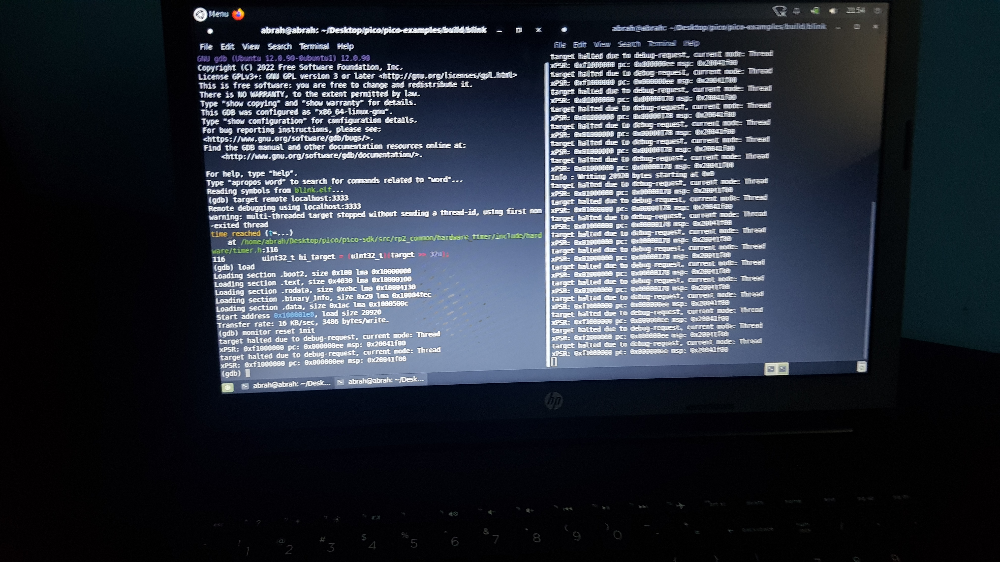
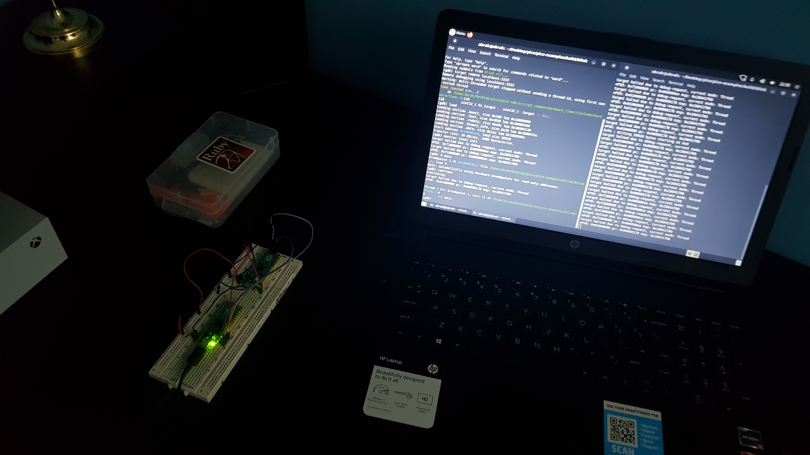

# 22apicoprobe-flores-deseusa

## Abraham Jhared Flores Azcona, 19211640
## Victor Manuel Sanchez Deseusa, 19211732

## Listado de ejercicios
- Debugging de programa por medio de una Picoprobe a otra.

---

### Debugging de programa por medio de una Picoprobe a otra.

#### Evidencia

https://user-images.githubusercontent.com/99265478/169218303-9bec5522-f33a-4c3c-bf2d-a69b682d492e.mp4

#### Comentarios
Hasta el momento a sido una de las tareas mas laboriosas debido a que los entornos SDK en linux requieren algo más de cuidado en las isntalaciones.
Aunque se tuvo la ayudad del PDF adjunto, hemos de admitir que se necesita algo de planeación para resolver el problema; lo decimos porque se
intentaron los tres métodos propuestos, pero el más efectivo resultó el método por OpenOCD y GDB en la terminal. Debido a que ya se contaba
con una experiencia similiar (Instalar Gentoo con un Distro LiveUSB), no se batalló con el diagnóstico de errores, de hecho, un serio problema fue el cableado
que simplemente se resolvió acomodando los cables jumpers de cierta manera que los programas se comunicasen. Algo curioso es que es necesario abrir dos terminales
para la comunicación por puerto serial para el debugging.

---

## Conclusión
La realización de las actiidades retadoras en entornos distintos a Windows nos permite refinar nuestras habiliades generales de dominio de la terminal,
diagnostico de problemas y sobre todo, paciencia. Al ver el fruto de nuestro trabajo, nos damos cuenta que siempre habrá una razón para no rendirse
en estos procedimientos, porque hay veces que lo más simple es lo que genera mayor problema, por lo que recomendamos realizar esta práctica con la mentalidad
de que su éxito no necesariamente resulte en el primer intento.
